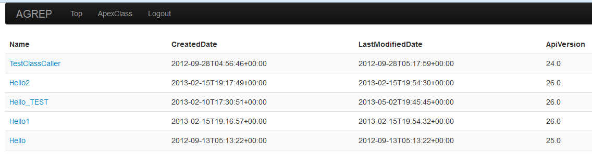

# agrepui

_Sinatra application to find Apex class, trigger, page and component_

## Screenshot



## Running

```
$ bundle exec rackup config.ru
```

## License

Released under the [MIT Licenses](http://opensource.org/licenses/MIT)

